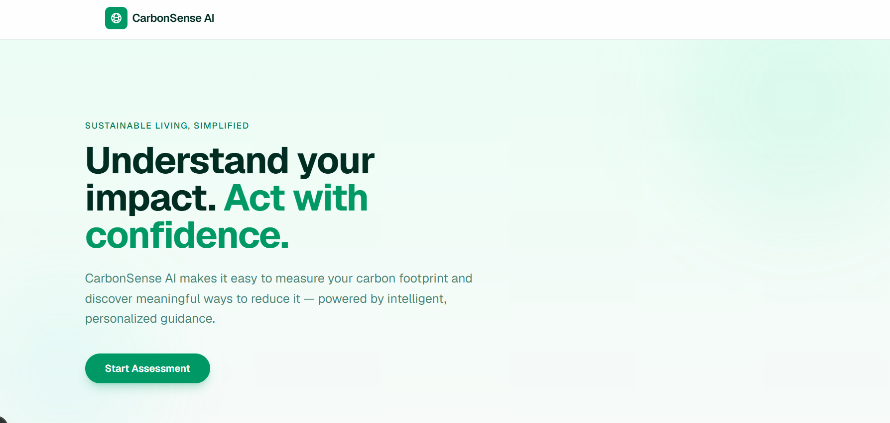
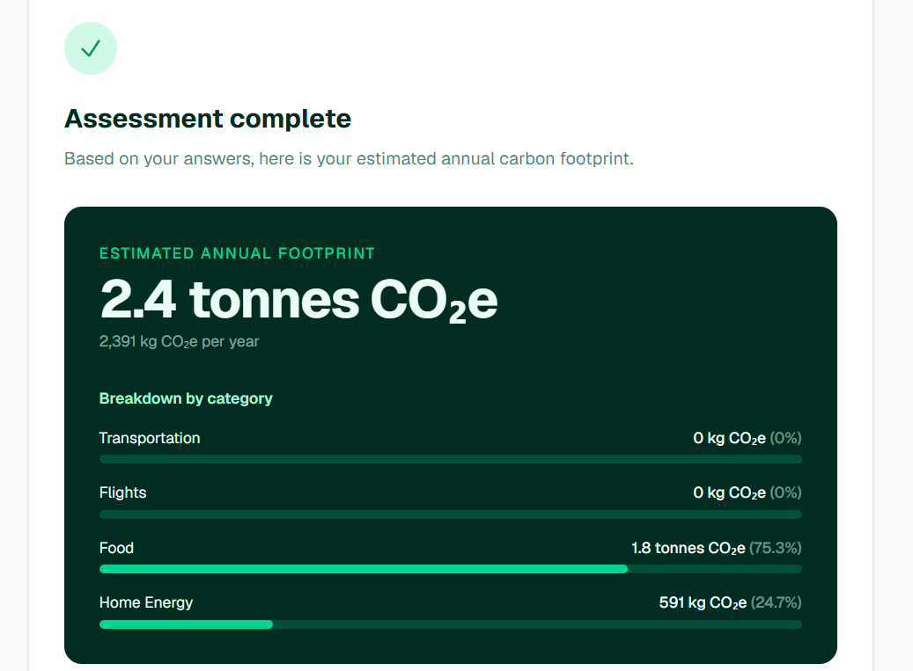
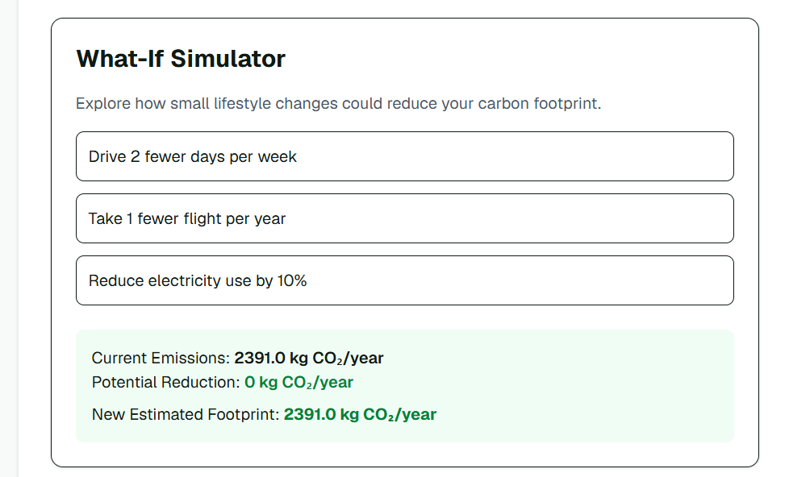
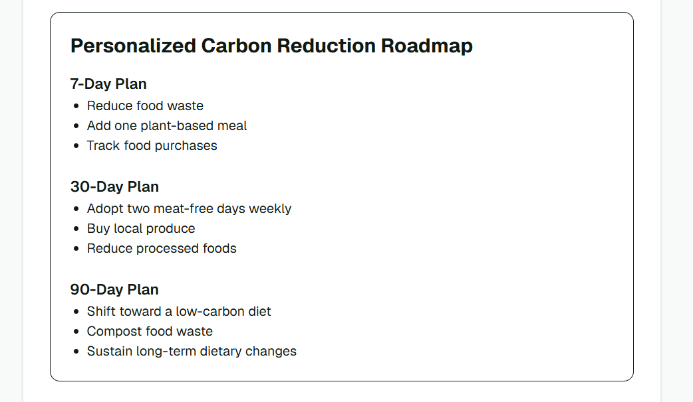

# CarbonSense AI

## Overview

CarbonSense AI is a web application that helps users understand and reduce their personal carbon footprint.

Users answer a short sustainability assessment covering transportation, travel, diet, and household energy usage. The application calculates an estimated carbon footprint, provides a category-wise emissions breakdown, generates AI-powered insights, and suggests practical actions to reduce emissions.

The project combines deterministic carbon calculations with Gemini-powered explanations to create a personalized sustainability assistant.

---

## Live Demo

https://carbonsense-ai-six.vercel.app/

## Screenshots









## Challenge Vertical

**Sustainability & Climate Action**

CarbonSense AI helps users become more aware of their environmental impact and encourages informed decisions that can contribute to lower carbon emissions.

---

## Features

### Carbon Footprint Assessment

Users provide information about:

* Transportation habits
* Daily commute distance
* Flights taken per year
* Diet type
* Monthly electricity usage

The application converts these inputs into an estimated annual carbon footprint.

### Emissions Breakdown

Results are categorized into:

* Transportation
* Flights
* Food
* Home Energy

Users can quickly identify which activities contribute most to their emissions.

### Sustainability Score

Users receive a sustainability grade based on their estimated annual carbon footprint.

| Grade | Annual Emissions |
|---------|---------|
| A | Very Low |
| B | Low |
| C | Average |
| D | High |
| E | Very High |

This provides an easy-to-understand indicator of environmental impact.

### Global Benchmark Comparison

CarbonSense AI compares the user's estimated footprint against global average annual carbon emissions.

This helps users understand how their lifestyle compares with broader sustainability benchmarks and highlights opportunities for improvement.

### AI-Powered Insights

Gemini analyzes the assessment results and generates personalized observations.

Examples include:

* Major sources of emissions
* High-impact areas for improvement
* Sustainability recommendations based on user responses

### What-If Simulator

The What-If Simulator allows users to explore how lifestyle changes could affect their estimated emissions.

This helps users understand the potential impact of different sustainability choices before making them.

### Goal Setting

Users can select a carbon reduction target and view projected savings.

Available targets include:

- 5% reduction
- 10% reduction
- 20% reduction

The application calculates estimated annual carbon savings and tracks progress toward the selected goal.

### Personalized Roadmap Generator

Based on the user's highest emission category, the application generates a tailored improvement roadmap.

Examples:

* Transportation-focused recommendations
* Home energy reduction strategies
* Food and diet improvement suggestions

This creates a more actionable experience than simply displaying emissions data.

### Priority Action Ranking

The application ranks recommended sustainability actions according to their expected impact.

Instead of presenting generic suggestions, CarbonSense AI prioritizes actions that can deliver the greatest emissions reduction based on the user's largest emission source.

Examples:

* Reduce driving — High Impact
* Use public transport — Medium Impact
* Walk for short trips — Low Impact

This improves decision-making by helping users focus on the most effective actions first.

### Carbon Progress Tracker

The Carbon Progress Tracker estimates how a user's emissions could decrease over time if recommended actions are followed.

The tracker provides a simple projection of future reductions, helping users visualize long-term sustainability progress and maintain motivation.

### Testing Strategy

The project includes automated Jest tests covering:

- Carbon footprint calculations
- Transportation emission changes
- Flight emission changes
- Diet impact comparisons
- Category breakdown validation
- Percentage calculations
- Unit conversion handling
- Currency conversion handling
- Edge cases
- Positive footprint generation
- Emission comparison scenarios

These tests help ensure correctness, reliability, and maintainability of the calculation engine.


## How Gemini Is Used

Gemini is used to generate personalized sustainability insights from the calculated assessment results.

The application first computes emissions using predefined carbon estimation logic and then provides Gemini with structured results. Gemini converts those results into natural-language recommendations and observations that are easier for users to understand and act upon.

---

## Smart Assistant Behavior

CarbonSense AI acts as an intelligent sustainability assistant by:

* Identifying the user's largest emission source
* Generating personalized sustainability insights
* Creating category-specific reduction roadmaps
* Prioritizing actions based on expected impact
* Projecting future carbon reduction progress

Rather than displaying emissions data alone, the assistant helps users understand, prioritize, and track meaningful sustainability improvements.

---

## Decision-Making Logic

The application follows a structured decision-making process:

1. Calculate emissions across transportation, flights, food, and home energy categories.
2. Identify the highest contributing emission source.
3. Generate targeted recommendations specific to that category.
4. Rank actions according to estimated environmental impact.
5. Allow users to simulate alternative lifestyle choices.
6. Project future reductions through progress tracking.

This approach ensures recommendations are personalized, explainable, and actionable rather than generic.

---

## Application Flow

1. User completes sustainability assessment
2. Carbon calculator estimates emissions
3. Emissions are categorized by source
4. Gemini generates personalized insights
5. What-If Simulator explores potential reductions
6. Roadmap Generator creates tailored recommendations
7. Priority Actions ranks recommendations by impact
8. Progress Tracker projects future emission reductions

---

## Tech Stack

* Next.js
* TypeScript
* Tailwind CSS
* Google Gemini API
* Jest

---

## Project Structure

```text
src/
├── app/
├── components/
│   ├── AssessmentResults.tsx
│   ├── WhatIfSimulator.tsx
│   └── RoadmapGenerator.tsx
├── lib/
│   └── carbon-calculator.ts
└── tests/
    └── carbonCalculator.test.ts
```

---

## Installation

```bash
git clone https://github.com/RizaShaik/carbonsense-ai.git

cd carbonsense-ai

npm install

npm run dev
```

Open:

```text
http://localhost:3000
```

---

## Running Tests

```bash
npm test
```

---

## Assumptions

* Carbon footprint values are estimates intended for educational purposes.
* User-provided information is self-reported.
* Results are designed to raise awareness and encourage sustainable choices rather than provide certified carbon accounting.

---

## Future Improvements

Potential enhancements include:

* More detailed transportation calculations
* Renewable energy recommendations
* Goal tracking and progress monitoring
* Historical footprint comparisons
* Region-specific emissions factors
* Expanded sustainability categories

---

## Conclusion

CarbonSense AI combines carbon footprint estimation, Gemini-powered insights, interactive exploration, and personalized recommendations to help users better understand their environmental impact and identify practical opportunities for improvement.
